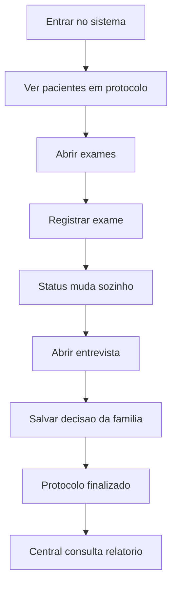

# Fluxo Guiado do Medico

## Para que serve
Este roteiro mostra o caminho completo do medico como se fosse uma trilha de execução.
A ideia e fazer voce enxergar o sistema em ordem, sem precisar abrir dezenas de arquivos de uma vez.

---

## 0) Mapa mental rapido



---

## 1) Etapa 1: entrar no sistema

### O que voce faz
- Abre a tela de login.
- Digita email e senha.
- Entra como MEDICO ou ENFERMEIRO.

### O que o frontend faz
- Arquivo: [frontend/src/componentes/login.js](frontend/src/componentes/login.js)
- O componente valida email e senha.
- O service envia a requisicao para o backend.
- O token JWT fica salvo no navegador.

### O que o backend faz
- Arquivo: [backend/src/main/java/back/backend/controller/UsuarioController.java](backend/src/main/java/back/backend/controller/UsuarioController.java)
- O usuario e validado no banco.
- O JWT e criado em [backend/src/main/java/back/backend/security/JwtUtil.java](backend/src/main/java/back/backend/security/JwtUtil.java)
- O filtro de seguranca libera ou bloqueia o acesso.

### O que observar
- Se a tela voltar para login, houve 401.
- Se o usuario entrar, a sessao ficou ativa.

---

## 2) Etapa 2: abrir a tela do medico

### O que voce faz
- Clica em Meu Protocolo ME.

### O que o frontend faz
- Arquivo: [frontend/src/componentes/AppLayout.js](frontend/src/componentes/AppLayout.js)
- O menu aparece apenas se a role permitir.
- A tela principal do medico e [frontend/src/componentes/MedicoProtocoloME.js](frontend/src/componentes/MedicoProtocoloME.js)

### O que observar
- O painel deve mostrar pacientes em protocolo.
- Se nao aparecer nada, pode ser ausencia de dados ou bloqueio de acesso.

---

## 3) Etapa 3: carregar pacientes em protocolo

### O que voce faz
- Apenas espera a lista carregar.

### O que o frontend faz
- [frontend/src/componentes/MedicoProtocoloME.js](frontend/src/componentes/MedicoProtocoloME.js)
- Faz GET em /api/protocolos-me.
- Deduplica os pacientes para nao repetir card.
- Filtra somente status relevantes.

### O que o backend faz
- [backend/src/main/java/back/backend/controller/ProtocoloMEController.java](backend/src/main/java/back/backend/controller/ProtocoloMEController.java)
- [backend/src/main/java/back/backend/service/ProtocoloMEService.java](backend/src/main/java/back/backend/service/ProtocoloMEService.java)
- O backend devolve os protocolos existentes e seus pacientes.

### O que observar
- Nome, CPF, hospital, status, exames e proximo passo.
- O status deve guiar o que vem depois.

---

## 4) Etapa 4: abrir exames

### O que voce faz
- Clica em Acessar Protocolo.

### O que o frontend faz
- [frontend/src/componentes/ExameMEManager.js](frontend/src/componentes/ExameMEManager.js)
- Mostra exames ja existentes.
- Permite criar novo exame, registrar resultado e deletar.

### O que o backend faz
- [backend/src/main/java/back/backend/controller/ExameMEController.java](backend/src/main/java/back/backend/controller/ExameMEController.java)
- [backend/src/main/java/back/backend/service/ExameMEService.java](backend/src/main/java/back/backend/service/ExameMEService.java)
- O service impede repeticao do mesmo tipo de exame no mesmo protocolo.
- Quando um exame relevante muda, o protocolo e recalculado.

### O que observar
- O contador de exames.
- O resumo de exames realizados.
- Se o mesmo exame tentar ser criado duas vezes, deve haver bloqueio.

---

## 5) Etapa 5: registrar resultado de exame

### O que voce faz
- Escolhe um exame.
- Registra resultado ou marca como realizado.

### O que o frontend faz
- Envia a acao para o endpoint de resultado.
- Atualiza a lista na tela.

### O que o backend faz
- [backend/src/main/java/back/backend/service/ExameMEService.java](backend/src/main/java/back/backend/service/ExameMEService.java)
- Grava o exame.
- Chama a regra que recalcula o status do protocolo.
- Sincroniza o paciente no espelho final.

### O que observar
- O status pode sair de NOTIFICADO para EM_PROCESSO, ou avancar mais.
- O card do paciente deve mudar sem precisar recarregar a pagina inteira.

---

## 6) Etapa 6: entender o que mudou

### Perguntas que voce deve fazer
1. O exame foi salvo?
2. O status do protocolo mudou?
3. O paciente foi sincronizado?
4. A lista do medico foi atualizada?

### Regra simples
Se o exame mudou e o status nao mudou, o problema esta no backend.
Se o status mudou mas a tela nao mudou, o problema esta no frontend.

---

## 7) Etapa 7: abrir entrevista familiar

### O que voce faz
- Clica em Realizar Entrevista.
- Marca entrevista.
- Marca se a familia autorizou ou recusou.
- Salva o resultado.

### O que o frontend faz
- [frontend/src/componentes/EntrevistaFamiliarManager.js](frontend/src/componentes/EntrevistaFamiliarManager.js)
- Mostra o formulario apenas quando a etapa estiver liberada.

### O que o backend faz
- [backend/src/main/java/back/backend/service/ProtocoloMEService.java](backend/src/main/java/back/backend/service/ProtocoloMEService.java)
- Atualiza o status para entrevista familiar.
- Registra o resultado final.
- Sincroniza o status da entrevista no paciente.

### O que observar
- Se a familia foi notificada.
- Se a decisão foi autorizada ou recusada.
- Se o protocolo terminou no estado correto.

---

## 8) Etapa 8: ir para a Central

### O que voce faz
- Abre o painel da Central.
- Escolhe um paciente.
- Gera o relatorio final.

### O que o frontend faz
- [frontend/src/componentes/CentralDashboardPage.js](frontend/src/componentes/CentralDashboardPage.js)
- Busca o relatorio final por paciente.
- Permite exportar em CSV ou abrir uma versao imprimivel.

### O que o backend faz
- [backend/src/main/java/back/backend/controller/PacienteController.java](backend/src/main/java/back/backend/controller/PacienteController.java)
- [backend/src/main/java/back/backend/service/PacienteService.java](backend/src/main/java/back/backend/service/PacienteService.java)
- Junta protocolos, exames e entrevista em um unico resumo.

### O que observar
- Status final do paciente.
- Quantidade de exames.
- Conclusao final do processo.

---

## 9) Como usar este roteiro na pratica

### Sessao 1
- Ler login.
- Ler segurança.
- Fazer login de verdade.

### Sessao 2
- Ler MedicoProtocoloME.
- Abrir um paciente real.
- Ver a lista de exames.

### Sessao 3
- Ler ExameMEManager e ExameMEService.
- Criar um exame.
- Ver o status mudar.

### Sessao 4
- Ler EntrevistaFamiliarManager e ProtocoloMEService.
- Abrir entrevista.
- Fechar o protocolo.

### Sessao 5
- Ler CentralDashboardPage e PacienteService.
- Gerar relatorio final.
- Exportar CSV ou PDF.

---

## 10) Regra de ouro

Se voce quer entender qualquer parte do sistema, siga sempre esta ordem:

```text
Clicar na tela -> Ver request no Network -> Abrir controller -> Abrir service -> Conferir regra de negocio -> Voltar para a tela
```

---

## 11) Arquivos de apoio

- [MAPA_VISUAL_DO_SISTEMA.md](MAPA_VISUAL_DO_SISTEMA.md)
- [FLUXO_MEDICO_PASSO_A_PASSO.md](FLUXO_MEDICO_PASSO_A_PASSO.md)
- [CHECKLIST_INTERATIVO_MEDICO.md](CHECKLIST_INTERATIVO_MEDICO.md)
- [GUIA_CLASSE_METODO_V2.md](GUIA_CLASSE_METODO_V2.md)
- [GUIA_CODIGO_BACK_FRONT.md](GUIA_CODIGO_BACK_FRONT.md)
