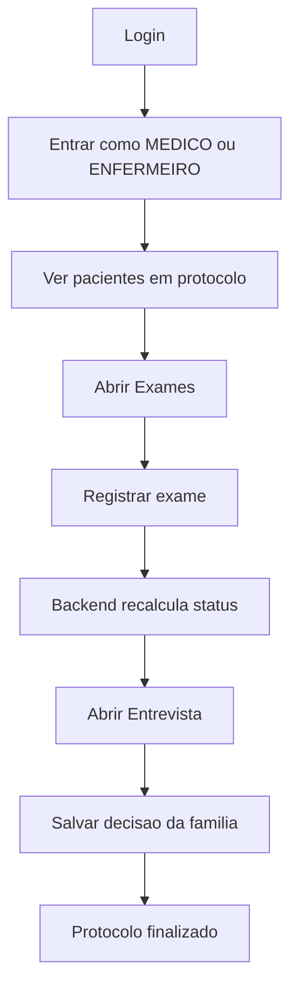
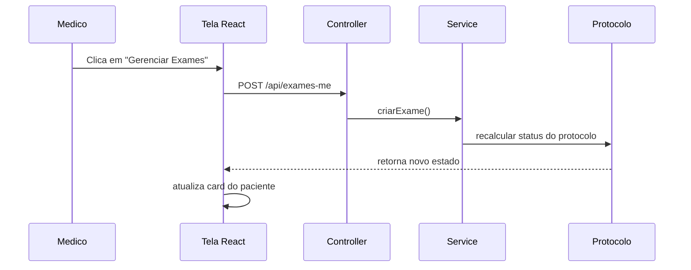

# Fluxo do Medico Passo a Passo

## Objetivo
Este arquivo existe para voce entender a logica do medico sem precisar ler o sistema inteiro de uma vez.
A ideia e seguir o caminho real do usuario na tela.

---

## 1) O caminho em uma frase



---

## 2) O que acontece em cada etapa

### Etapa 1: login
- Arquivo principal: [frontend/src/componentes/login.js](frontend/src/componentes/login.js)
- O usuario entra com email e senha.
- O backend devolve o token JWT.
- O frontend salva o token e a sessao fica ativa.

### Etapa 2: abrir a tela do medico
- Arquivo principal: [frontend/src/componentes/AppLayout.js](frontend/src/componentes/AppLayout.js)
- O menu mostra o link de acordo com a role.
- Medico e enfermeiro acessam [frontend/src/componentes/MedicoProtocoloME.js](frontend/src/componentes/MedicoProtocoloME.js).

### Etapa 3: carregar pacientes
- Arquivo principal: [frontend/src/componentes/MedicoProtocoloME.js](frontend/src/componentes/MedicoProtocoloME.js)
- A tela chama `/api/protocolos-me`.
- A lista mostra apenas pacientes que realmente estao em protocolo.
- O componente deduplica os pacientes para nao repetir card.

### Etapa 4: abrir exames
- Arquivo principal: [frontend/src/componentes/ExameMEManager.js](frontend/src/componentes/ExameMEManager.js)
- O medico cria exame, registra resultado ou remove exame.
- O frontend envia a acao para [backend/src/main/java/back/backend/controller/ExameMEController.java](backend/src/main/java/back/backend/controller/ExameMEController.java).
- O service aplica a regra de negocio em [backend/src/main/java/back/backend/service/ExameMEService.java](backend/src/main/java/back/backend/service/ExameMEService.java).

### Etapa 5: atualizar status
- Arquivos centrais:
  - [backend/src/main/java/back/backend/service/ExameMEService.java](backend/src/main/java/back/backend/service/ExameMEService.java)
  - [backend/src/main/java/back/backend/service/ProtocoloMEService.java](backend/src/main/java/back/backend/service/ProtocoloMEService.java)
- Quando um exame relevante fica pronto, o protocolo muda de status.
- O paciente tambem recebe o espelho desse status.

### Etapa 6: entrevista familiar
- Arquivo principal: [frontend/src/componentes/EntrevistaFamiliarManager.js](frontend/src/componentes/EntrevistaFamiliarManager.js)
- A entrevista so deve aparecer quando a ME estiver confirmada.
- O usuario marca a entrevista e depois salva a decisao da familia.
- O backend grava o resultado final e sincroniza o paciente.

### Etapa 7: consultar a Central
- Arquivo principal: [frontend/src/componentes/CentralDashboardPage.js](frontend/src/componentes/CentralDashboardPage.js)
- A Central nao altera nada.
- Ela apenas le o estado final e gera relatorio.

---

## 3) Fluxo do clique ao resultado



---

## 4) Regra de ouro para nao se perder

Sempre que voce olhar um botao, responda estas 4 perguntas:
1. Qual arquivo desenha esse botao?
2. Qual endpoint ele chama?
3. Qual service decide a regra?
4. O que muda depois na tela?

Se voce conseguir responder isso, voce entendeu o fluxo.

---

## 5) Resumo visual rapido

```text
LOGIN
  -> TOKEN
  -> LISTA DE PACIENTES
  -> EXAMES
  -> STATUS AUTOMATICO
  -> ENTREVISTA
  -> RELATORIO FINAL
```

---

## 6) Arquivos para abrir junto

- [frontend/src/componentes/MedicoProtocoloME.js](frontend/src/componentes/MedicoProtocoloME.js)
- [frontend/src/componentes/ExameMEManager.js](frontend/src/componentes/ExameMEManager.js)
- [frontend/src/componentes/EntrevistaFamiliarManager.js](frontend/src/componentes/EntrevistaFamiliarManager.js)
- [backend/src/main/java/back/backend/controller/ProtocoloMEController.java](backend/src/main/java/back/backend/controller/ProtocoloMEController.java)
- [backend/src/main/java/back/backend/service/ProtocoloMEService.java](backend/src/main/java/back/backend/service/ProtocoloMEService.java)
- [backend/src/main/java/back/backend/controller/ExameMEController.java](backend/src/main/java/back/backend/controller/ExameMEController.java)
- [backend/src/main/java/back/backend/service/ExameMEService.java](backend/src/main/java/back/backend/service/ExameMEService.java)
- [backend/src/main/java/back/backend/service/PacienteService.java](backend/src/main/java/back/backend/service/PacienteService.java)
