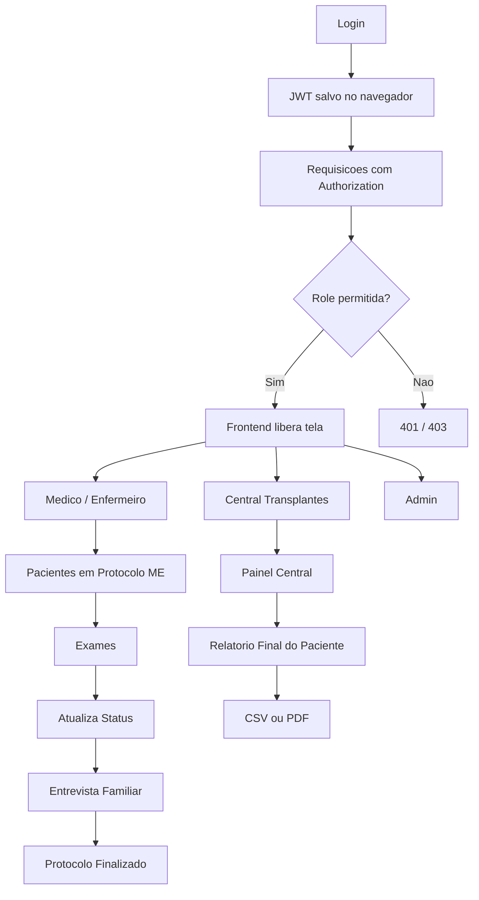
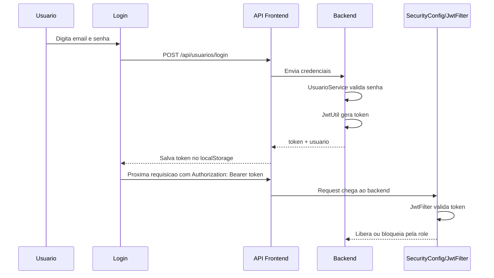
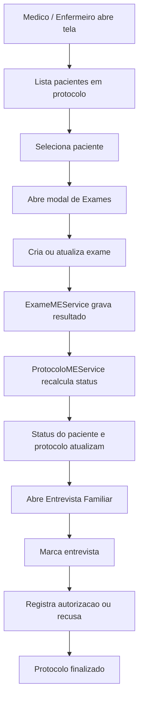
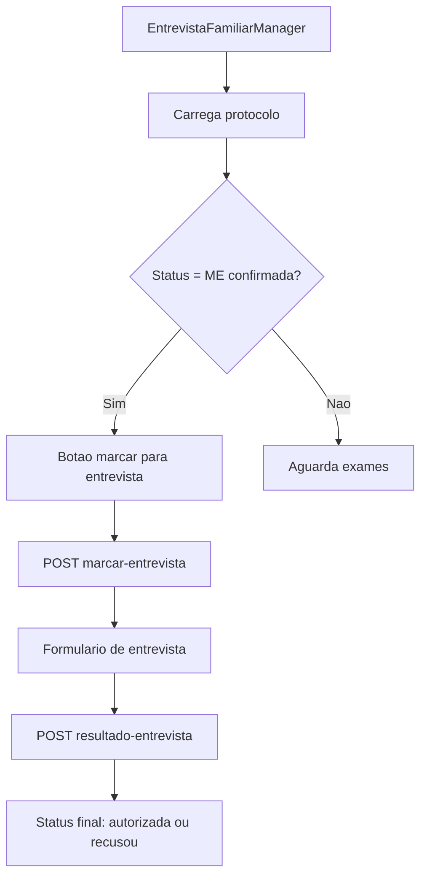
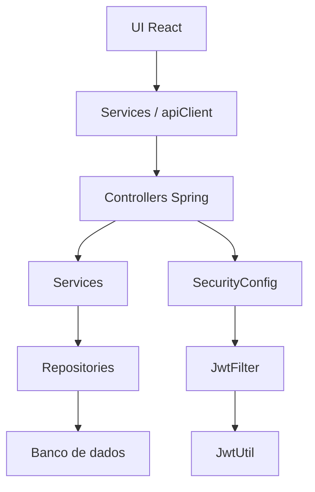

# Mapa Visual do Sistema

## Como ler este mapa
Pense no sistema em 3 blocos:
1. Autenticacao e permissao.
2. Fluxo clinico do protocolo ME.
3. Visao da Central e relatorio final.

Se voce seguir essa ordem, a logica do codigo fica muito mais clara.

---

## 1) Visao Geral



---

## 2) Fluxo de Autenticacao



### O que observar
- O token nasce no login.
- O frontend sempre tenta reaproveitar o token.
- O backend decide acesso por role.
- Se der 401, o usuario volta para o login.
- O fluxo de protocolo precisa carregar exames e órgãos doados juntos sem disparar erro de múltiplas coleções no Hibernate.
- Se a listagem do médico quebrar com 500, o primeiro ponto a revisar é o carregamento detalhado do protocolo no backend.

---

## 3) Fluxo do Protocolo ME



### Regra mental
- Exame muda o status.
- Status libera entrevista.
- Entrevista fecha o processo.
- O paciente guarda o espelho do que aconteceu.

---

## 4) Fluxo dos Exames

```mermaid
graph LR
  A[ExameMEManager] --> B[POST /api/exames-me]
  A --> C[POST /api/exames-me/{id}/resultado]
  A --> D[DELETE /api/exames-me/{id}]

  B --> E[ExameMEController]
  C --> E
  D --> E

  E --> F[ExameMEService]
  F --> G[ProtocoloMEService]
  G --> H[Atualiza status automatico]
```

### Leitura rapida
- Frontend monta a tela.
- Controller recebe a request.
- Service decide a regra.
- Protocolo faz o recalculo final.

---

## 5) Fluxo da Entrevista



### Regra mental
- Sem confirmacao de ME, entrevista nao avanca.
- A entrevista possui dois estados visiveis: em andamento e concluida.

---

## 6) Fluxo da Central

```mermaid
graph TD
  A[CentralDashboardPage] --> B[GET /api/protocolos-me]
  B --> C[Lista pacientes e protocolos]
  C --> D[Seleciona paciente]
  D --> E[GET /api/pacientes/{id}/relatorio-final]
  E --> F[Mostra resumo consolidado]
  F --> G[Exporta CSV]
  F --> H[Imprime PDF]
```

### Regra mental
- A Central nao altera o fluxo.
- Ela enxerga e exporta o resultado.
- O relatorio final junta paciente, protocolo, exames e entrevista.

---

## 7) Mapa rapido de camadas



---

## 8) Como estudar usando este mapa

1. Comece pela autenticacao.
2. Depois siga o fluxo do protocolo ME.
3. Em seguida leia a entrevista.
4. Depois entenda a Central e o relatorio.
5. Volte ao codigo e tente localizar cada seta do diagrama.

---

## 9) Arquivos principais para abrir junto com o mapa

- [frontend/src/componentes/login.js](frontend/src/componentes/login.js)
- [frontend/src/componentes/MedicoProtocoloME.js](frontend/src/componentes/MedicoProtocoloME.js)
- [frontend/src/componentes/ExameMEManager.js](frontend/src/componentes/ExameMEManager.js)
- [frontend/src/componentes/EntrevistaFamiliarManager.js](frontend/src/componentes/EntrevistaFamiliarManager.js)
- [frontend/src/componentes/CentralDashboardPage.js](frontend/src/componentes/CentralDashboardPage.js)
- [backend/src/main/java/back/backend/security/SecurityConfig.java](backend/src/main/java/back/backend/security/SecurityConfig.java)
- [backend/src/main/java/back/backend/service/ProtocoloMEService.java](backend/src/main/java/back/backend/service/ProtocoloMEService.java)
- [backend/src/main/java/back/backend/service/ExameMEService.java](backend/src/main/java/back/backend/service/ExameMEService.java)
- [backend/src/main/java/back/backend/service/PacienteService.java](backend/src/main/java/back/backend/service/PacienteService.java)

## 10) Fluxo do medico em detalhe

Se voce quiser estudar so o caminho do medico, use este roteiro mais sequencial:
- [FLUXO_GUIADO_MEDICO.md](FLUXO_GUIADO_MEDICO.md)
